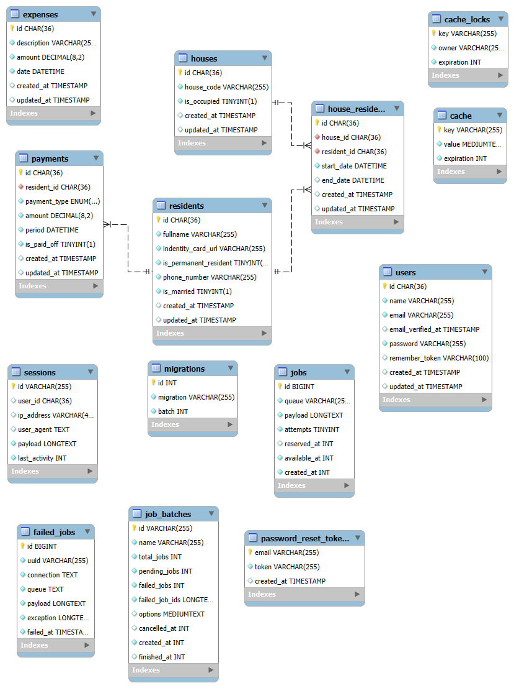

# ERD


# How to run and setup development
- open git bash terminal and direct to your desired folder
- clone this project
```bash
git clone https://github.com/Garongan/backend-sistem-pengelolaan-iuran.git
```
- setup environment variable
```bash
cp .env.example .env
composer install
php artisan key:generate
php artisan jwt:secret
php artisan storage:link
```
- create mysql database with name sipi_db
- change DB_USERNAME and DB_PASSWORD with your mysql username and password
- run the migrations
```bash
php artisan migrate:fresh --seed
```
- run backend application
```bash
php artisan serve
```
- follow the instructions from this repo

# Note
- dont change the admin fullname, email, and password
